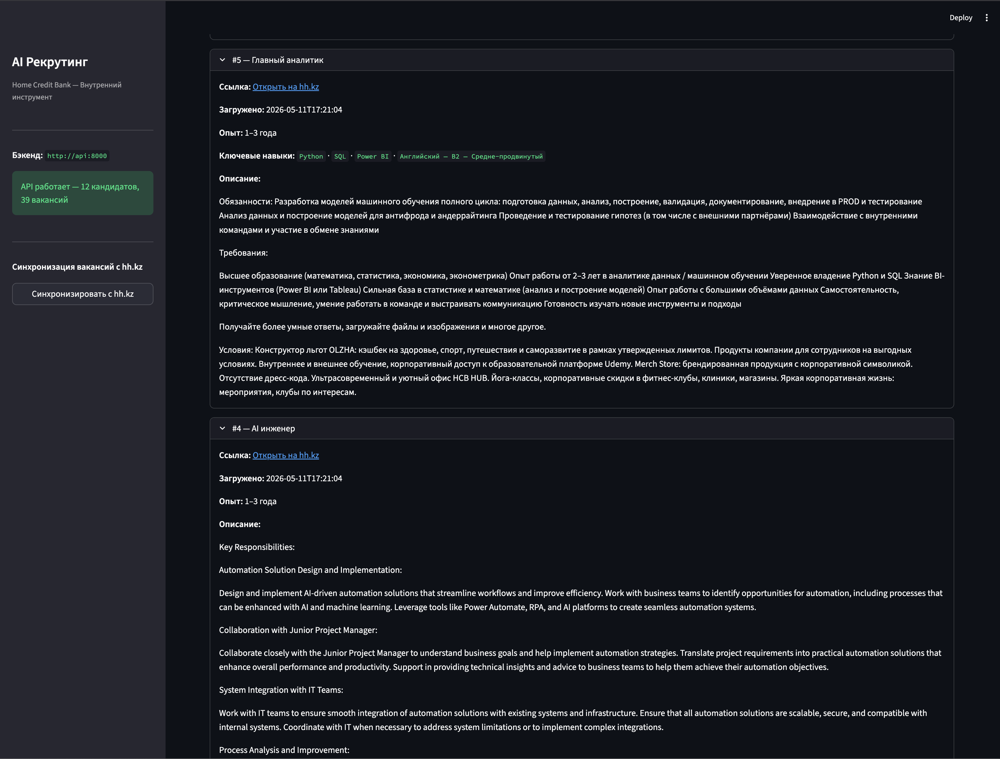
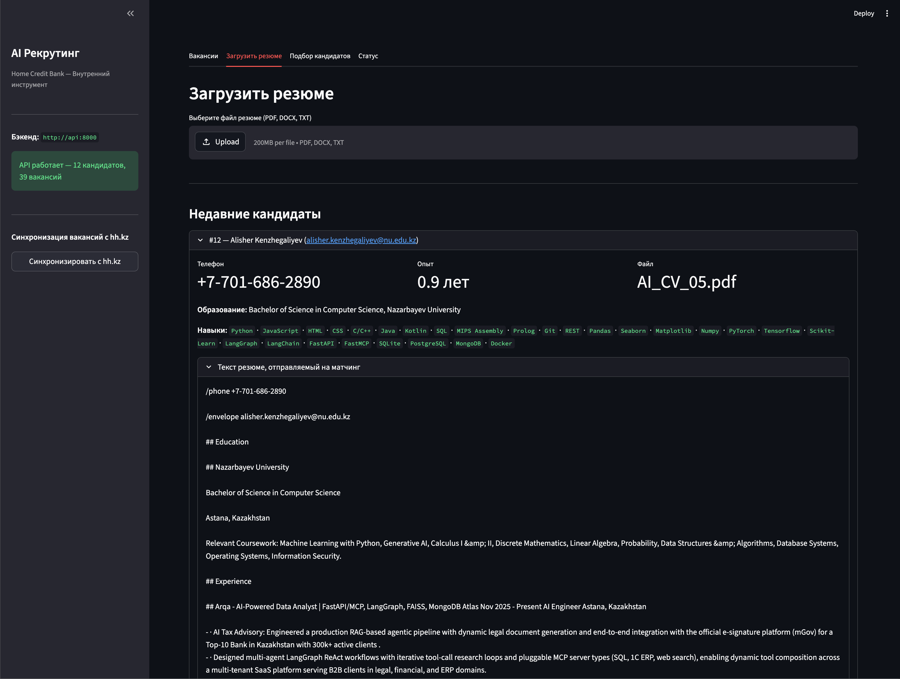
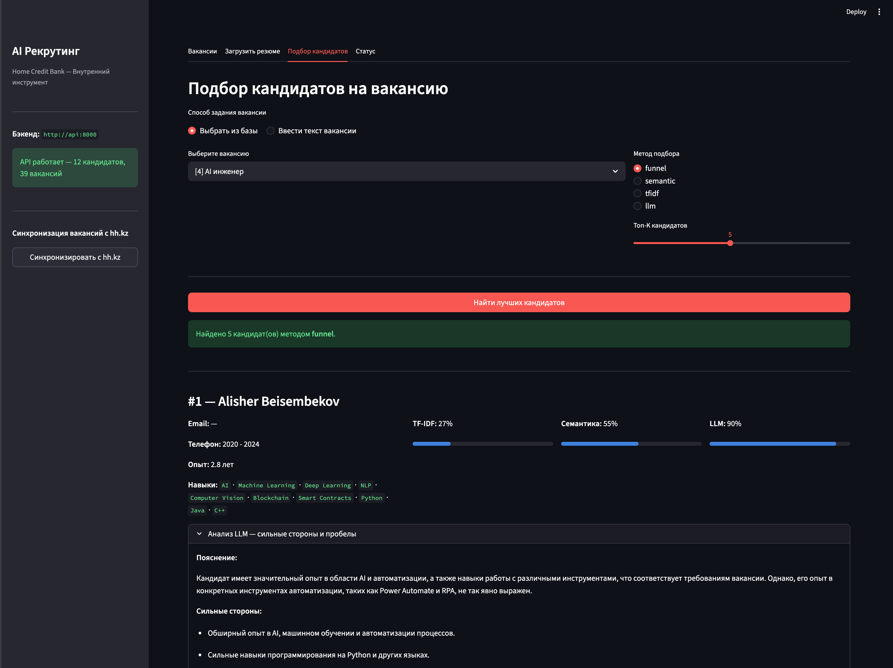
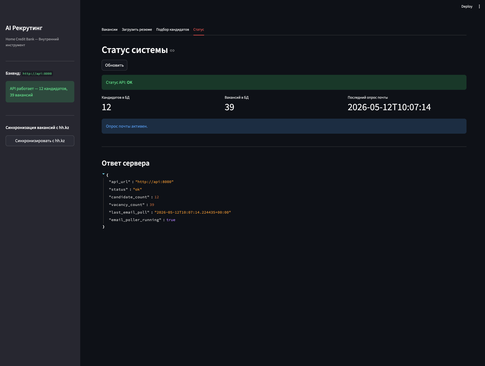
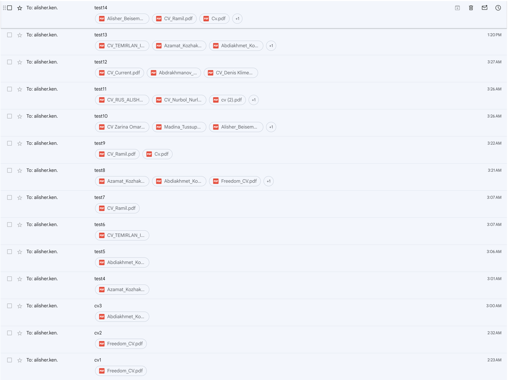
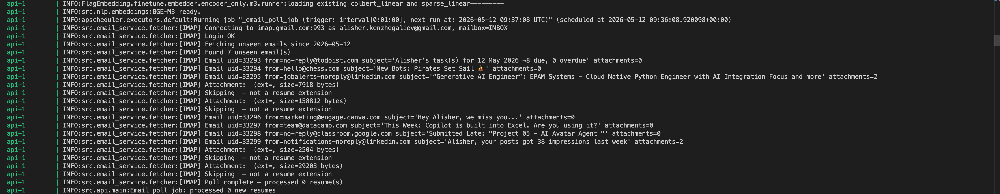

# AI Рекрутинговый Агент — Home Credit Bank

Комплексный AI-пайплайн для подбора персонала в **АО Home Credit Bank (ДБ АО «ForteBank»)**:
- Автоматически загружает резюме из почты (IMAP) или через ручную загрузку
- Собирает актуальные вакансии с hh.kz (ID работодателя 49971) через Playwright
- Ранжирует кандидатов с помощью 3-этапной воронки: TF-IDF → семантика BGE-M3 → OpenAI LLM
- REST API (FastAPI) + интерактивный интерфейс (Streamlit)

## Скриншоты

**Список вакансий** — загружены с hh.kz в реальном времени через Playwright:


**Загрузка резюме** — загрузка файла с мгновенным отображением распознанного профиля кандидата:


**Подбор кандидатов** — результат 3-этапной воронки с оценками TF-IDF / семантика / LLM и пояснением от LLM:


**Статус системы** — состояние API, счётчики БД, статус опроса почты:


**Почтовый ящик** — тестовые письма с PDF-резюме, автоматически загруженными через IMAP:


**Docker-логи** — контейнер API: BGE-M3 готов, APScheduler запущен, IMAP-авторизация выполнена:


---

## Архитектура

```
Почтовый ящик (IMAP)        hh.kz
       │                      │
       ▼                      ▼
[Загрузка писем]       [Playwright-скрапер]
       │                      │
       ▼                      ▼
[Парсер docling]        [База вакансий]
       │
       ▼
[База кандидатов (PostgreSQL)]
       │
       ▼
[3-этапная воронка подбора]
  1. TF-IDF cosine          (sklearn)
  2. Семантика BGE-M3       (FlagEmbedding)
  3. Оценка LLM OpenAI      (gpt-4o-mini; резерв: Groq llama-3.3-70b-versatile)
       │
       ▼
[FastAPI] ──► [Streamlit UI]
```

## Воронка подбора

| Этап | Метод | Порог по умолчанию | Назначение |
|---|---|---|---|
| 1 | TF-IDF cosine (sklearn) | ≥ 0.05 | Лексический фильтр — быстрое отсеивание явных несоответствий |
| 2 | Плотные эмбеддинги BGE-M3 | ≥ 0.35 | Семантический фильтр релевантности |
| 3 | OpenAI gpt-4o-mini (резерв: Groq) | топ-K | Глубокий анализ с возвратом `{score, explanation, strengths, gaps}` |

Каждый метод (`tfidf`, `semantic`, `llm`) можно использовать отдельно через параметр `method`.

## Быстрый старт

```bash
cp .env.example .env
# Укажите OPENAI_API_KEY (основной LLM) или GROQ_API_KEY (резерв)
# При необходимости настройте IMAP_* для загрузки резюме из почты
docker-compose up --build
```

- **Документация API:** http://localhost:8000/docs
- **Streamlit UI:** http://localhost:8501

> **Примечание про `make`:** `Makefile` предоставляет удобные сокращения, но требует утилиты `make`, которая по умолчанию недоступна на Windows. Пользователям Windows следует использовать **WSL** или **Git Bash**, либо запускать Docker-команды напрямую (см. ниже).

## Команды

| Задача | Mac/Linux (`make`) | Windows / Docker напрямую |
|---|---|---|
| Запустить все сервисы | `make up` | `docker-compose up -d` |
| Собрать и запустить | `make build` | `docker-compose up --build` |
| Остановить все сервисы | `make down` | `docker-compose down` |
| Только Postgres (локальная разработка) | `make db` | `docker-compose up -d postgres` |
| Логи API | `make logs-api` | `docker-compose logs -f api` |
| Все логи | `make logs` | `docker-compose logs -f` |
| Оболочка API-контейнера | `make shell-api` | `docker-compose exec api bash` |

## Переменные окружения

| Переменная | Обязательна | Описание |
|---|---|---|
| `OPENAI_API_KEY` | **Да** (основной) | Ключ OpenAI API — используется для парсинга и LLM-матчинга |
| `OPENAI_MODEL` | Нет | Модель OpenAI (по умолчанию: `gpt-4o-mini`) |
| `GROQ_API_KEY` | Нет (резерв) | Ключ Groq API — используется, если `OPENAI_API_KEY` не задан |
| `GROQ_MODEL` | Нет | Модель Groq (по умолчанию: `llama-3.3-70b-versatile`) |
| `IMAP_HOST` | Нет | IMAP-сервер (например, imap.gmail.com) |
| `IMAP_USER` | Нет | Email-адрес почтового ящика для резюме |
| `IMAP_PASSWORD` | Нет | Пароль от почты / пароль приложения |
| `TFIDF_THRESHOLD` | Нет | Порог этапа 1 (по умолчанию 0.05) |
| `SEMANTIC_THRESHOLD` | Нет | Порог этапа 2 (по умолчанию 0.35) |

## Справочник API

| Метод | Путь | Описание |
|---|---|---|
| GET | `/health` | Статус системы, счётчики кандидатов/вакансий, время последнего опроса почты |
| POST | `/candidates/upload` | Загрузить файл резюме (PDF/DOCX/TXT) |
| GET | `/candidates/` | Список всех распознанных кандидатов |
| POST | `/vacancies/scrape` | Запустить скрапинг вакансий с hh.kz через Playwright |
| GET | `/vacancies/` | Список всех вакансий |
| GET | `/vacancies/{id}` | Получить одну вакансию |
| GET | `/recommendations/` | Подобрать кандидатов: `?job_id=1&method=funnel&top_k=5` или `?vacancy_text=...&method=funnel` |

## Примеры curl

```bash
# Проверка состояния
curl http://localhost:8000/health

# Загрузить резюме
curl -X POST http://localhost:8000/candidates/upload \
  -F "file=@candidate_resume.pdf"

# Запустить скрапинг вакансий hh.kz
curl -X POST http://localhost:8000/vacancies/scrape

# Топ-5 кандидатов (3-этапная воронка) для вакансии ID 1
curl "http://localhost:8000/recommendations/?job_id=1&method=funnel&top_k=5"

# Только семантический матчинг
curl "http://localhost:8000/recommendations/?job_id=1&method=semantic&top_k=10"
```

## Технологический стек

| Компонент | Технология |
|---|---|
| Парсинг резюме | `docling` (IBM) — поддержка сканированных PDF, многоколоночных и кириллических документов |
| Скрапинг вакансий | `playwright` — обход DDoS Guard hh.kz (API возвращает 403) |
| Эмбеддинги | `BAAI/bge-m3` через FlagEmbedding — лучшая модель <1B на бенчмарке RTEB |
| TF-IDF | `scikit-learn` TfidfVectorizer |
| LLM | `openai` SDK — gpt-4o-mini (основной); `groq` SDK — llama-3.3-70b-versatile (резерв) |
| База данных | PostgreSQL 16 + SQLAlchemy async (asyncpg) |
| API | FastAPI + uvicorn |
| Фронтенд | Streamlit |
| Почта | `imap-tools` (IMAP-опрос) |
| Планировщик | APScheduler 3.x |
| Контейнеризация | Docker Compose |
